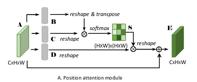
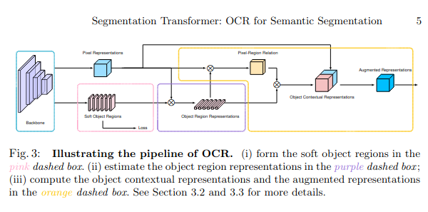
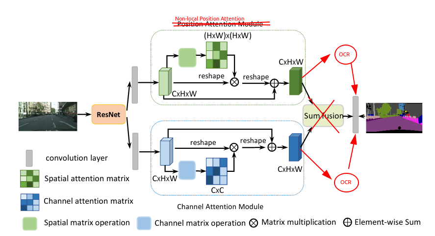

#                 Fuse DANet and OCR in remote segmentation

**Authors:** 

JiaKui Hu 19050100220

ZhiHeng Shao 19050100219 、 KaiQi Xu 19050500144

## Abstract

In this article, we try to fuse OCR with DANet, expecting it to achieve better results in the semantic segmentation task of remote sensing images. However, experiments show that the CrossEntropyLoss of the DANet model slowly decreases normally and the CrossEntropyLoss of the DANet_OCR model shows first decreasing and then increasing when training 5 epochs and the learning rate is set very small (3e-7). We believe that the Object Contextual Representation conflicts with the Position Attention Module in DANet, and thus the model cannot be trained successfully. We investigated this phenomenon in depth and made some modifications to the network structure of DANet to reduce the computational effort of the model while improving the system's performance. Our code will be publicly available at: https://github.com/jkhu29/remote-segmentation.

## Introduction

With the rapid development of remote sensing acquisition technology, the application of high-resolution remote sensing images (HRRSI) is becoming more and more widespread. We know that because the semantic segmentation of remote sensing images is crucial for applications such as earth observation, land use, land cover and mapping, we want to develop a semantic segmentation algorithm with higher robustness and higher accuracy for HRRSI images. However, because HRRSI contains a large amount of ground object information, it presents diversity and complexity, and the intra-class variance is large and inter-class variance is small, and the category differentiation is low, which makes semantic segmentation more difficult. So we intend to add Object-Contextual Representations to the original DANet, so that the model can learn more refined inter-class variance with the help of the image's own contextual information.

Currently, deep convolution networks are the mainstream solution to this type of problem. The early work mainly revolves around the spatial scope, and the representative work is ASPP, who adopts a multi-scale, and divide-and-conquer scheme; meanwhile, with DANet as an example, more and more work starts to pay attention to the relationship between a location and its contextual location, and aggregates the representations of contextual locations, and assigns higher weights to the similar representations. Among them, OCR (Object-Contextual Representations) also adopts a different idea from methods such as DANet, which explicitly transforms the pixel classification problem into an object-region classification problem. It differs from methods such as DeepLabv3 in that OCR enhances the category information of the objects themselves. ocr computes a set of object region feature representations and then propagates these object region feature representations to each pixel based on the similarity between the object region feature representations and the pixel feature representations.

Our motivation is easy to understand: we aim to combine the two methods, DANet and OCR, so that our new model can learn more comprehensively the contextual information in the image to get a more accurate segmentation method.

## Related Work

**DANet**

The idea of [DANet](https://arxiv.org/abs/1809.02983) is very simple, using different attention modules to improve the performance of the network by learning spatial attention and channel attention simultaneously.

Channel-Attention Module proposed in [SENet](https://arxiv.org/abs/1709.01507):
```python
class ChannelAttention(nn.Module):
    def __init__(self, channels: int = 2048, reduction: int = 8):
        super(ChannelAttention, self).__init__()

        self.avg_pool = nn.AdaptiveAvgPool2d(1)
        self.conv = nn.Sequential(
            nn.Conv2d(channels, channels // reduction, kernel_size=1, bias=True),
            nn.ReLU(inplace=True),
            nn.Conv2d(channels // reduction, channels, kernel_size=1, bias=True),
            nn.Sigmoid()
        )

    def forward(self, x):
        score = self.conv(self.avg_pool(x))
        return x * score
```

For spatial attention, a lightweight module is proposed in the paper


```python
class PositionAttention(nn.Module):
    def __init__(self, channels: int = 2048, reduction: int = 8):
        super(PositionAttention, self).__init__()
        self.conv1 = nn.Conv2d(channels, channels // reduction, 1)
        self.conv2 = nn.Conv2d(channels, channels // reduction, 1)
        self.conv3 = nn.Conv2d(channels, channels, 1)
        self.alpha = nn.Parameter(torch.zeros(1))

    def forward(self, x):
        n, c, h, w = x.shape
        x_embed1 = self.conv1(x).view(n, -1, h * w).permute(0, 2, 1)
        x_embed2 = self.conv2(x).view(n, -1, h * w)
        attetion = F.softmax(torch.bmm(x_embed1, x_embed2), dim=-1)
        x_embed1 = self.conv3(x).view(n, -1, h * w)
        x_embed2 = torch.bmm(x_embed1, attetion.permute(0, 2, 1)).view(n, -1, h, w)
        x = self.alpha * x_embed2 + x

        return x

```

**Object Contextual Representation**

The idea of OCR is to distinguish the contextual information of the same target category from the contextual information of different non-target categories, which is generally done in three steps.

1. obtain the segmentation target, get the initial segmentation result in the middle of the segmentation network through the segmentation head (OCR_Head), and later divide it into K different targets according to the categories of different pixels in the segmentation result.
2. Calculate the features of the target region, here the feature expression of each region is obtained by calculating the segmentation probability of each target with the input feature map.
3. Calculate the target contextual features and correlate the different target region representations with the current pixel points.

```python
class ObjectAttentionBlock(nn.Module):
    def __init__(self, in_channels: int = 256, key_channels: int = 128, scale: int = 1):
        super(ObjectAttentionBlock, self).__init__()
        self.key_channels = key_channels
        self.scale = scale
        self.pool = nn.MaxPool2d(kernel_size=(scale, scale))
        self.up = nn.UpsamplingBilinear2d(scale_factor=scale)

        self.to_q = nn.Sequential(
            ConvReLU(in_channels, out_channels=key_channels, kernel_size=1, padding=0),
            ConvReLU(key_channels, out_channels=key_channels, kernel_size=1, padding=0)
        )
        self.to_k = nn.Sequential(
            ConvReLU(in_channels, out_channels=key_channels, kernel_size=1, padding=0),
            ConvReLU(key_channels, out_channels=key_channels, kernel_size=1, padding=0)
        )
        self.to_v = ConvReLU(in_channels, out_channels=key_channels, kernel_size=1, padding=0)
        self.f_up = ConvReLU(key_channels, out_channels=in_channels, kernel_size=1, padding=0)

    def forward(self, features, context):
        n, c, h, w = features.shape
        if self.scale == 1:
            features = self.pool(features)

        query = self.to_q(features).view(n, -1, c)
        key = self.to_k(context).view(n, c, -1)
        value = self.to_v(context).view(n, -1, c)

        sim_map = torch.matmul(query, key)
        sim_map *= self.key_channels ** -0.5
        sim_map = F.softmax(sim_map, dim=-1)
        context = torch.matmul(sim_map.squeeze(), value.squeeze()).view(n, c, h, w)

        context = self.f_up(context)
        context = self.up(context)
        return context


class SpatialOCR(nn.Module):
    def __init__(self, in_channels, key_channels, out_channels, scale=1, dropout=0.5):
        super(SpatialOCR, self).__init__()
        self.object_context_block = ObjectAttentionBlock(in_channels, key_channels, scale)
        self.conv_bn_dropout = nn.Sequential(
            ConvReLU(2 * in_channels, out_channels=out_channels, kernel_size=1, padding=0),
            nn.Dropout2d(dropout),
        )

    def forward(self, feats, context):
        context = self.object_context_block(feats, context)
        output = self.conv_bn_dropout(torch.cat([context, feats], dim=1))
        return output


class SpatialGather(nn.Module):
    def __init__(self, n_classes: int = 100, scale: int = 1):
        super(SpatialGather, self).__init__()
        self.cls_num = n_classes
        self.scale = scale

    def forward(self, features, probs):
        n, k, _, _ = probs.shape
        _, c, _, _ = features.shape
        probs = probs.view(n, k, -1)
        features = features.view(n, -1, c)
        probs = torch.softmax(self.scale * probs, dim=-1)
        ocr_context = torch.matmul(probs, features)
        return ocr_context.view(n, k, c, 1)

```

From the code we can see that the essence is still to obtain global information through self-attention, which is closer to the idea of DANet.

## DANet_OCR

In this section, we first present our modification of the OCR Method and then describe how to combine DANet with the OCR Method. The former uses the non-local attention method, which can better extract to the spatial features of the image, with the disadvantage that it will significantly increase the computational effort. The latter feeds the original features into OCR together with the features specialized by DANet, and uses the features extracted by backbone that are suitable for classification to compensate for the possible drawback that the features extracted by DAHead cannot be robustly classified.

### Overview

Our algorithm is very simple. We refer to the Position Attention mechanism and replace the key and value in OCR with the two embedding matrices in Non-Local Attention, and the query in OCR adopts the final output of Non-Local Attention. At the same time, we change the coupling way between OCR and backbone in HRNet_OCR algorithm, and OCR is directly added to the tail of HRNet in HRNet_OCR. In order to better integrate the original features with the features after extracting the context, in our algorithm, we add OCR to the backbone of DANet (we use ResNeXT50) and the final output of DANet respectively, and feed these features together into the subsequent model for segmentation.

### non-local attention with OCR

**non-local attention**

In general image segmentation tasks, we usually use ASPP, Deeplab to fit the final model. Among them, the CRF method exists in Deeplabv1, with the idea of treating the whole image as a physical field. This approach can fully use the global information of the image, but it is seriously unrealistic: the information of a single image cannot be modeled by a physical field.

In order to reuse the global information of the upper image, we can introduce the self-attention mechanism. It can quickly capture long range dependencies by computing the relationship between two locations (which can be temporal, spatial and spatio-temporal).

Non-local attention is a manifestation of self-attention in the field of computer vision. It intends to better capture the statistical global information of the whole image and is a spatial soft attention mechanism.

About the general operation of self-attention
1. calculate the similarity between the query and the corresponding key to get the weight of the patch
2. normalize the weights so that they are in the same value domain [0, 1]
3. sum the normalized weights and the value corresponding to the key to obtain the attention matrix

In [Non-local Neural Networks](https://arxiv.org/abs/1711.07971), a self-attention module based on non-local mean filtering in the image filtering domain is proposed:

1. first perform pointwise conv on the input feature map, and then obtain the compressed features
2. by reshape operation, merge the dimensions of the above three features except the number of channels, and then perform pointwise conv on the two embedding to get their autocorrelation feature matrix
3. then normalize the autocorrelation features to obtain the self-attention coefficients with the value range [0, 1].
4. Finally, the attention coefficients are multiplied back into the feature matrix, and then pointwise conv is performed to superimpose with the original input feature map to obtain the attention matrix

code below:

```python
class NonLocalAttention(nn.Module):
    def __init__(self, channels: int = 2048):
        super(NonLocalAttention, self).__init__()
        self.conv1 = nn.Conv2d(channels, channels, 1, 1)
        self.relu1 = nn.ReLU(inplace=True)

        self.conv2 = nn.Conv2d(channels, channels, 1, 1)
        self.relu2 = nn.ReLU(inplace=True)

        self.conv3 = nn.Conv2d(channels, channels, 1)
        self.relu3 = nn.ReLU(inplace=True)

    def forward(self, x):
        x_embed1 = self.relu1(self.conv1(x))
        x_embed2 = self.relu2(self.conv2(x))
        x_assembly = self.relu3(self.conv3(x))

        n, c, h, w = x_embed1.shape
        x_embed1 = x_embed1.permute(0, 2, 3, 1).view(n, h * w, c)
        x_embed2 = x_embed2.view(n, c, h * w)
        score = torch.matmul(x_embed1, x_embed2)
        score = F.softmax(score, dim=2)
        x_assembly = x_assembly.view(n, -1, h * w).permute(0, 2, 1)
        x_final = torch.matmul(score, x_assembly).permute(0, 2, 1).view(n, -1, h, w)

        return x_final

```

We can find that in DANet, the Position Attention module is very similar to the Non-local Attention module, which refers to the reduction operation and depthwise convolution in Channel Attention, with the aim of reducing the computation. We can also follow this approach to rewrite Non-local Attention to reduce the computation:

```python
class NonLocalPositionAttention(nn.Module):
    def __init__(self, channels: int = 2048, reduction: int = 8):
        super(NonLocalPositionAttention, self).__init__()
        self.conv1 = nn.Conv2d(channels, channels // reduction, 1, 1)
        self.relu1 = nn.ReLU(inplace=True)

        self.conv2 = nn.Conv2d(channels, channels // reduction, 1, 1)
        self.relu2 = nn.ReLU(inplace=True)

        self.conv3 = nn.Conv2d(channels, channels, 1)
        self.relu3 = nn.ReLU(inplace=True)

        self.alpha = nn.Parameter(torch.zeros(1))

    def forward(self, x):
        n, _, h, w = x.shape
        x_embed1 = self.relu1(self.conv1(x)).view(n, -1, h * w).permute(0, 2, 1)
        x_embed2 = self.relu2(self.conv2(x)).view(n, -1, h * w)
        x_assembly = self.relu3(self.conv3(x))

        attention = F.softmax(torch.bmm(x_embed1, x_embed2), dim=-1)
        x_embed2 = torch.bmm(x.view(n, -1, h * w), attention.permute(0, 2, 1)).view(n, -1, h, w)

        x_final = self.alpha * x_embed2 + x_assembly

        return x_final

```

**connection to OCR and DANet Attention Modules**

As we known, some features of self-attention are also present in OCR, which is why we want to merge DANet with OCR: their separate use of self-attention will lead to an inflated computation of the whole model; the repeated implementation of the same features by both will lead to a model that does not learn the features sufficiently and will have a module that produces slack, making the model lose its proper normalization performance.



In the general case, we use the OCR in this way:

```python
class DANet_OCR(nn.Module):
    def __init__(self, n_classes: int = 100, channels: int = 256, ocr_mid_channels: int = 256, ocr_key_channels: int = 256):
        super(DANet_OCR, self).__init__()
        self.danet = DANet(channels, aux=False)
        self.soft_object_regions = nn.Sequential(
            nn.Conv2d(channels, channels, kernel_size=3, stride=1, padding=1),
            nn.GroupNorm(channels, channels),
            nn.LeakyReLU(0.2, inplace=True),
            nn.Conv2d(channels, channels, kernel_size=3, stride=1, padding=1)
        )
        self.pixel_representations = ConvReLU(channels, out_channels=ocr_mid_channels, kernel_size=3)
        self.object_region_representations = SpatialGather(n_classes)
        self.object_contextual_representations = SpatialOCR(
            in_channels=ocr_mid_channels,
            key_channels=ocr_key_channels,
            out_channels=ocr_mid_channels,
            scale=1,
            dropout=0.5,
        )
        self.augmented_representation = nn.Conv2d(ocr_mid_channels, n_classes, kernel_size=1, padding=0)

    def forward(self, x):
        features = self.danet(x)[0]
        out_aux = self.soft_object_regions(features)
        features = self.pixel_representations(features)
        context = self.object_region_representations(features, out_aux)
        features = self.object_contextual_representations(features, context)
        out = self.augmented_representation(features)
        return out

```

OCR is a filter on top of the output of the baseline(like HRNet, DANet), So we can add OCR to each of the two attention mechanisms of DANet, and then integrate them to get the final result.



## Experiments(TODO)

In our experimental state, our model fails to converge when adding the OCR mechanism directly behind the DANet. After modifying it according to our method, it can converge faster compared to the general DANet.

(sorry, no enough GPUs)

## Conclusions

In this work, we have successfully combined DANet with OCR. The main reason for the success is that, similar to the idea of model integration, we mix different image contextual feature learning methods to obtain more comprehensive image information. Through our experiments, we believe that our approach successfully combines the advantages of both methods and achieves better results on the benchmark dataset.

## References

1. [Object-Contextual Representations for Semantic Segmentation](https://arxiv.org/abs/1909.11065)
2. [Dual Attention Network for Scene Segmentation](https://arxiv.org/abs/1809.02983)
3. [Non-local Neural Networks](https://arxiv.org/abs/1711.07971)
3. [Squeeze-and-Excitation Networks](https://arxiv.org/abs/1709.01507)
3. [High-resolution networks and Segmentation Transformer for Semantic Segmentation](https://arxiv.org/abs/1908.07919)
3. [Rethinking Atrous Convolution for Semantic Image Segmentation](https://arxiv.org/abs/1706.05587)
